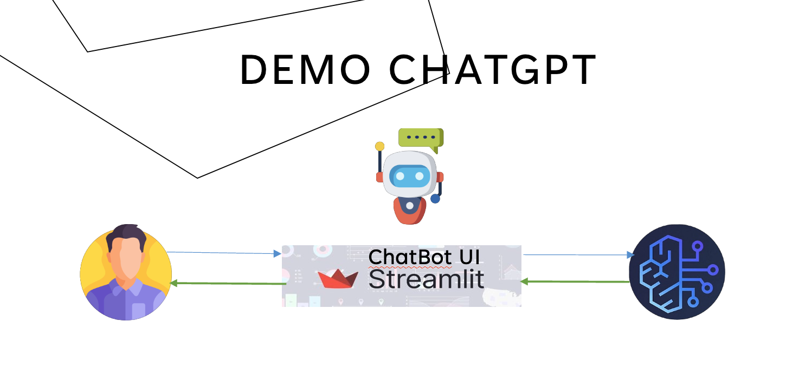

# Bedrock Chatbot Tutorial

## 1. Greetings

"Hello everyone, and welcome to this tutorial on building a chatbot with LangChain and AWS Bedrock!"

## Architecture


## 2. Intro to the Project

"Today, we'll create a chatbot that leverages the power of AWS Bedrock and LangChain. We'll be using Anthropic's Claude v2 model to generate responses. This chatbot will allow users to ask questions in different languages and receive answers powered by a large language model. We will also use Streamlit to create a simple GUI."

## 3. Demo of a Working App

"[Show a quick demo of the Streamlit app. Select a language from the sidebar, type a question, and show the chatbot's response. Demonstrate how changing the language affects the responses.]"

## 4. How To Section (Code Walkthrough)

"Now, let's break down the code step by step."

**Step 1: Setting up the environment**

* "First, ensure you have the necessary libraries installed. You'll need `langchain`, `boto3`, and `streamlit`. You can install them using pip:"

    ```bash
    pip install langchain boto3 streamlit
    ```

* "Make sure you have your AWS credentials configured. You can do this by setting up an AWS profile or environment variables."

**Step 2: Importing Libraries and Setting Up Bedrock Client**

* "We begin by importing the required libraries and creating a Bedrock client."

    ```python
    from langchain.chains import LLMChain
    from langchain.llms.bedrock import Bedrock
    from langchain.prompts import PromptTemplate
    import boto3
    import streamlit as st

    bedrock_client = boto3.client(
        service_name="bedrock-runtime",
        region_name="us-east-1"
    )

    modelID = "anthropic.claude-v2"
    ```

* "We initialize the Bedrock client and specify the model ID (`anthropic.claude-v2`)."

**Step 3: Initializing the LLM and Prompt Template**

* "Next, we initialize the LangChain LLM with the Bedrock client and define the prompt template."

    ```python
    llm = Bedrock(
        model_id=modelID,
        client=bedrock_client,
        model_kwargs={"max_tokens_to_sample": 1000,"temperature":0.9}
    )

    prompt = PromptTemplate(
        input_variables=["language", "freeform_text"],
        template="You are a chatbot. You are in {language}.\n\n{freeform_text}"
    )
    ```

* "The prompt template allows us to dynamically insert the language and user input into the prompt."

**Step 4: Creating the Chatbot Function**

* "We define the `my_chatbot` function, which takes the language and user input as arguments."

    ```python
    def my_chatbot(language, freeform_text):
        bedrock_chain = LLMChain(llm=llm, prompt=prompt)
        response = bedrock_chain({'language': language, 'freeform_text': freeform_text})
        return response
    ```

* "This function creates an `LLMChain` and uses it to generate a response from the Bedrock model."

**Step 5: Building the Streamlit Interface**

* "Finally, we build the Streamlit interface."

    ```python
    st.title("Bedrock Chatbot")

    language = st.sidebar.selectbox("Language", ["english", "spanish"])
    if language:
        freeform_text = st.sidebar.text_area(label="what is your question?", max_chars=100)

    if freeform_text:
        response = my_chatbot(language, freeform_text)
        st.write(response['text'])
    ```

* "This code creates a sidebar for language selection and a text area for user input. The chatbot's response is then displayed on the screen."

**Step 6: Running the Streamlit App**

* "To run the app, save the code as a `.py` file (e.g., `chatbot.py`) and run the following command in your terminal:"

    ```bash
    streamlit run chatbot.py
    ```

## 5. Thanks and Ask for Comments/Questions

"Thank you for watching! I hope this tutorial helped you understand how to build a chatbot with LangChain and AWS Bedrock. If you have any questions or comments, please leave them below. Don't forget to like and subscribe for more tutorials! You can find the code on my GitHub [link to your GitHub repository]."