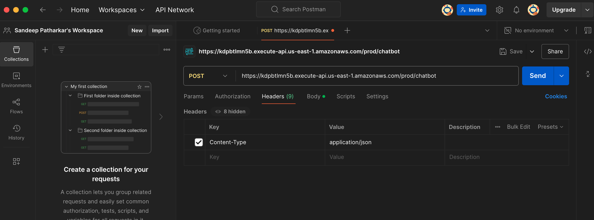
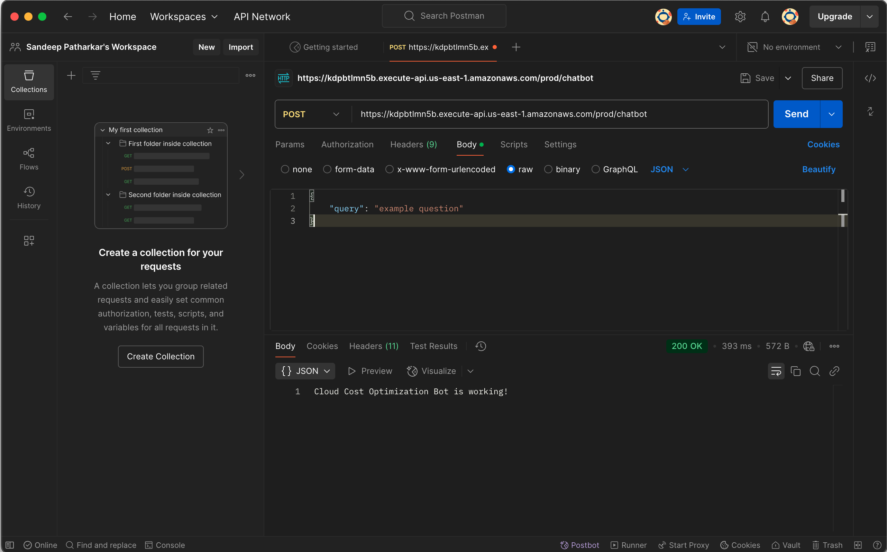

# chatbot
chatbot repo for aws bedrock

 ## AWS configure with profile
 aws configure --profile <name>
 aws configure list-profiles
 cat ~/.aws/credentials        # This also has all the profiles but this will list the access keys and secret access key.
 echo $AWS_PROFILE             # shows current active profile 
 aws sts get-caller-identity   # This shows account# and the iam user configured

## API Gateway Endpoint - POST Test via cmd
curl -X POST https://kdpbtlmn5b.execute-api.us-east-1.amazonaws.com/prod/chatbot/ \
-H "Content-Type: application/json" \
-d '{"query": "example question"}'

Test via Postman
method - Post  
url - https://kdpbtlmn5b.execute-api.us-east-1.amazonaws.com/prod/chatbot/  

Postman Header 

<!-- Using HTML for resizing -->
 

Postman Body  

## Set virtual environment for a clean run
python3 -m venv chatbot-env1
source chatbot-env1/bin/activate  # On MacOS/Linux

chatbot-env\Scripts\activate     # On Windows

## Run Streamline py
streamlit run python3 main.py

## Docker

docker build -t docker-chatapp . 
`docker run -e BUCKET_NAME=sandeep-patharkar-faiss-store-bckt -v ~/.aws:/root/.aws -p 8502:8502 -it docker-chatapp`

## S3 bucket name
sandeep-patharkar-gen-ai-bckt
sandeep-patharkar-faiss-store-bckt
